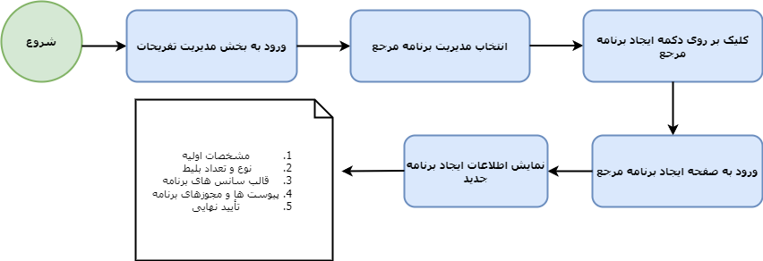

**ایجاد برنامه جدید**

برای ایجاد و تعریف برنامه جدید، کاربران با 5 مرحله ذیل روبه‌رو هستند:

- مشخصات اولیه
- نوع و تعداد بلیط
- قالب سانس های برنامه
- پیوست‌ها و مجوزهای برنامه
- تأیید نهایی

در نمودار زیر، فرآیند و مراحل ایجاد برنامه جدید، آورده شده است. 

**ایجاد برنامه جدید – مشخصات اولیه**

اولین بخش در فرآیند ایجاد برنامه جدید، درج مشخصات اولیه است که در این بخش اطلاعاتی نظیر(عنوان برنامه، دسته بندی، قوانین، توضیحات، محل اجرا، ظرفیت و فیلتر آژانس‌ها) دریافت می شود. 

**عنوان برنامه:** منظور از عنوان، درج نام برنامه ای است که کاربر قصد ایجاد کردن آن را دارد. 

**دسته‌بندی:**. لیستی از دسته بندی برنامه ها نظیر پارک‌ها و تفریحات، رستوران‌های موسیقی زنده، استراحت و تمدد اعصاب و ... برای کاربر نمایش داده می شود و کاربر تأمین کننده با توجه به ماهیت برنامه تفریحی، از میان لیست نمایش داده شده، انتخاب می کند. 

**قوانین:** هر برنامه تفریحی می تواند دارای قوانین و مقررات خاصی باشد که شرکت‌کنندگان باید درباره آنها اطلاع داشته باشند و این اطلاعات را باید به هنگام ایجاد برنامه، ذکر کرد. به عنوان مثال، ممکن است امکان شرکت و حضور کودکان زیر 5 سال برای برنامه گشت تفریحی با کشتی ممنوع باشد که این موضوع باید در بخش قوانین مطرح شود. 

**توضیحات:** در صورت نیاز به ارائه توضیحات بیشتر در ارتباط با برنامه تفریحی، این توضیحات در این بخش درج می شود. 

**محل اجرا:** نام کشور، استان و شهر محل برگزاری برنامه درج می شود. امکان درج نام محل اجرای برنامه، از طریق سرچ باکس یا با تایپ چند کاراکتر از نام منطقه مورد نظر وجود دارد. 

**ظرفیت:** هر برنامه تفریحی دارای ظرفیت مشخصی است که باید به هنگام ایجاد برنامه، اطلاعات مربوط به ظرفیت درج گردد تا بیشتر از تعداد تعیین شده، فروخته نشود. همچنین اطلاعات دیگری نظیر الزامی بودن درج نام و نام خانوادگی، درج کدملی/پاسپورت و اعلام فروش در این بخش از کاربر تأمین کننده دریافت می شود. 

**فیلتر آژانس‌ها:** فیلتر آژانس ها شامل دو بخش (**عمومی و خصوصی**) هستند. در صورتی که کاربر فیلتر عمومی را انتخاب نماید، آژانس هایی که در لیست وجود دارند، امکان مشاهده برنامه تعریف شده را ندارند. به عنوان مثال تأمین کننده Z برنامه مرجعی را تعریف کرده است و می خواهد این برنامه برای تعدادی از آژانس‌ها نمایش داده نشود. می تواند با انتخاب فیلتر عمومی و درج نام آژانس ها در باکس زیر، قابلیت مشاهده برنامه را از این آژانس ها سلب نماید. 

اما هنگامی که فیلتر خصوصی انتخاب شود، می توان مشخص کرد چه آژانس‌هایی برنامه ایجاد شده را مشاهده نمایند. 

**ایجاد برنامه جدید – نوع و تعداد بلیط**

دومین بخش در فرآیند ایجاد برنامه جدید، مشخص کردن نوع بلیط‌ها و تعداد آنها می‌باشد. در واقع مرحله دوم ایجاد برنامه جدید، شامل دو قسمت: درج عنوان بلیط و درج تعداد بلیط است.  در ابتدا کاربر تأمین کننده باید عنوان موردنظر برای بلیط خود را وارد نماید. پس از درج نام بلیط و سپس کلیک بر روی دکمه (**اضافه کردن**)**،** پنجره‌ای به صورت Pop-up باز می‌شود . در این پنجره امکان تعریف تعداد و قیمت بلیط و کمیسیون(درصد و ریال) بلیط در شهر برگزارکننده ایونت و سایر شهرها، وجود دارد. اگر تعداد بلیطی که در این بخش تعریف می شود با تعداد بلیط تعریف شده در مرحله اول مغایرت داشته باشد پیامی برای کاربر نمایش داده می شود. پس باید تعدا بلیط ها یکسان باشد. به عنوان مثال اگر در مرحله اول در بخش ظرفیت، تعداد بلیط ها 50 عدد تعریف شده باشد و در این مرحله در قسمت تعداد بلیط عدد 100 درج شود، ارور برای کاربر نمایش داده می شود. 

تعریف کمیسیون بلیط ها نیز به صورت درصدی و ریالی می باشد. قابلیت تعریف کمیسیون های متفاوت در شهر برگزار کننده رویداد با سایر شهرها وجود دارد. 

**ایجاد برنامه جدید – قالب سانس برنامه**

در این قسمت کاربر می‌توانند سانس مربوط به برنامه تفریحی خود را ایجاد کنند تا برنامه فعال برای آژانس ها نمایش داده شود. 

این قسمت نیز همانند مرحله پیش، متشکل از 2 بخش است که ابتدا عنوان سانس درج می شود و سپس با انتخاب دکمه (**اضافه کردن**)، پنجره‌ای به صورت Pop-up باز شده است، که اطلاعات زمانی سانس شامل : شروع سانس، پایان سانس و پایان رزرو می باشد که پس از درج اطلاعات زمانی سانس، سانس مورد نظر به صورت قالب در صفحه نمایش داده می شود. 

**شروع سانس:** منظور زمان شروع سانس برنامه است که کاربر باید ساعتی که سانس شروع می شود را درج نماید. 

**پایان سانس:** در این بخش نیز ساعت پایان سانس تعریف شده درج می شود. 

**پایان رزرو:** منظور ساعتی است که قابلیت رزرو سانس وجود دارد و کاربران می توانند تا قبل از این ساعت، برنامه تفریحی را مشاهده و آن را رزرو نمایند. 

پس از ایجاد سانس برنامه، در صفحه مربوطه سانس های ایجاد شده نمایش داده می شود که قابلیت ویرایش، قالب سانس وجود دارد. در واقع با کلیک بر روی علامت (مداد) در گوشه سمت چپ، می‌توان قالب را از همین صفحه ویرایش کرد.

**ایجاد برنامه جدید – پیوست‌ها و مجوزهای برنامه**

پس از افزودن اطلاعات مربوط به سانس برنامه، کاربران به مرحله بارگزاری مجوزها، وارد می‌شود. در این مرحله برای برنامه تفریحی ایجاد شده نیاز است تصاویر مربوط به **مجوز، تصویر اصلی برنامه، گالری و تصویر چاپ بر روی بلیط**  آپلود شود. هر بخش دارای محدودیت حجم برای بارگزاری تصاویر است

**ایجاد برنامه جدید – تأیید نهایی**

تمامی اطلاعات درج شده در ارتباط با برنامه جدید، به طور کلی در این صفحه نمایش داده می شود، تا در صورتی که مورد تأیید است، یا نیاز به ویرایش دارد، کاربر به راحتی بتواند نسبت به ویرایش یا تأیید آن اقدام نماید. پس از تأیید نهایی کاربر به صفحه (**مدیریت برنامه مرجع**)**  انتقال داده می شود که قابلیت مشاهده تمامی برنامه از این صفحه وجود دارد. به عنوان مثال کاربر Z در پنل کاربری خود، 3 برنامه (تست، سفر تابستانی و جنگ تابستانی کیش) را از پیشتر تعریف کرده بود، پس از ایجاد برنامه (N)، 4 برنامه نمایش داده می شود.  

**دکمه بازگشت به لیست**

برای بازگشت به صفحه برنامه‌های مرجع، می توان با انتخاب دکمه **(بازگشت به لیست)**  به صفحه قبل بازگشت و به برنامه‌های ایجاد شده دسترسی داشت.
