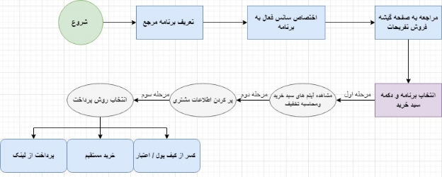

## **مقدمه**

در این بخش پس از ایجاد یک برنامه و سانس فعال ، اطلاعات برنامه درماژول گیشه فروش خدمات ومنوی فروش تفریحات نمایش داده می شود.لیست تمام برنامه های فعال به تفکیک  مکان و روز و تاریخ و فیلتر های دسته بندی در این صفحه مشاهده می شود.

## **اهداف** 

- نمایش برنامه های فعال بر اساس تاریخ و بازه زمانی و مکان مورد نظر اجرا 
- نمایش صفحه فاکتور ها و سبد خرید 

## **شرح جزئی عملیات**

پس از قرار گرفتن در منوی فروش تفریحات ، کاربر با مشخص کردن مکان و تاریخ و روز اجرا و فیلتر دسته بندی انواع اجراها ، برنامه مورد نظر خود را انتخاب کرده و تعداد رزرو های برنامه را مشخص و با زدن دکمه ایجاد سبد خرید به صفحه سبد خرید هدایت می شود.

## **سبد خرید** 

صفحه سبد خرید از 3 مرحله به ترتیب ایجاد شده است :

- مشاهده آیتم های سبد خرید و محاسبه تخفیف
- اطلاعات مشتری 
- انتخاب روش پرداخت 

1.مشاهده آیتم های سبد خرید و محاسبه تخفیف 

در این صفحه در نمای اول اطلاعات قیمتی 	رزروها در باکس های نمایشی در بالای صفحه اضافه شده است و در تمامی سه مرحله در بالای صفحه نمایش داده می شوند. این اطلاعات شامل موارد زیر می باشد : 

- مجموع قیمت واچر ها 
- پرداختی آژانس 
- کمیسیون آژانس 
- تخفیف 
- پرداختی مشتری

آیتم های سبد خرید نیز به شرح زیر می باشد : 

- نام تامین کننده 
- تاریخ انقضا
- عنوان برنامه 
- تعداد 
- مبالغ بلیط 
- کمیسیون 
- خرید 
- مبلغ تخفیف 
- حذف موارد موجود در سبد خرید 

کاربر پس از بررسی آیتم های موجود در سبد خرید، با انتخاب مرحله بعد به صفحه اطلاعات مشتری هدایت می شود.

## **2. اطلاعات مشتری** 

در این بخش اطلاعات مشتری به تفکیک موارد زیر باید توسط کاربر کامل شود تا به مرحله بعد برود : 

- نام کامل 
- تلفن همراه 
- محل اقامت 
- شماره فاکتور داخلی
- توضیحات مورد نظر 

## **3.انتخاب روش پرداخت**

برای پرداخت رزرو ها 3 روش برای پرداخت وجود دارد : 

1.کسر از کیف پول / اعتبار 

2.خرید مستقیم 

3.پرداخت از لینک 

- **کسر از کیف پول / اعتبار** 

در این حالت مالک برنامه توریست پنل ، مبلغ مورد نظر خود را برای کیف پول خود شارژ می کند یا از طریق سیستم اعتباری،این عملیات را پیش می برد که برای توضیحات بیشتر می توانید به داکیومنت کسر از کیف پول و اعتبار مراجعه نمایید.

- **خرید مستقیم** 

در این حالت مالک به صفحه درگاه پرداخت آنلاین هدایت شده و رزرو را به صورت آنلاین و مستقیم پرداخت می کند.

- **پرداخت از لینک** 

قابلیت دیگری برای پرداخت توسط مشتری می باشد که مالک می تواند با ارسال لینک پرداخت برای مشتری ، این قابلیت را ایجاد سازد تا فاکتور به صورت مستقیم توسط مشتری پرداخت بشود.

**نکته**

پس از انتخاب گزینه پرداخت ، واچری برای رزروها با شماره مخصوص به آن صادر خواهد شد که با انتخاب گزینه چاپ فاکتور یا چاپ واچر ، قابل مشاهده می باشد.هم چنین لیست آرشیو رزرو ها در ماژول گزارشات ،منوی فروش تفریحات، شماره فاکتور رزرو قابلیت نمایش و دسترسی دارد که در داکیومنت گزارشات و فروش تفریحات مفصل توضیح د اده شده است .

