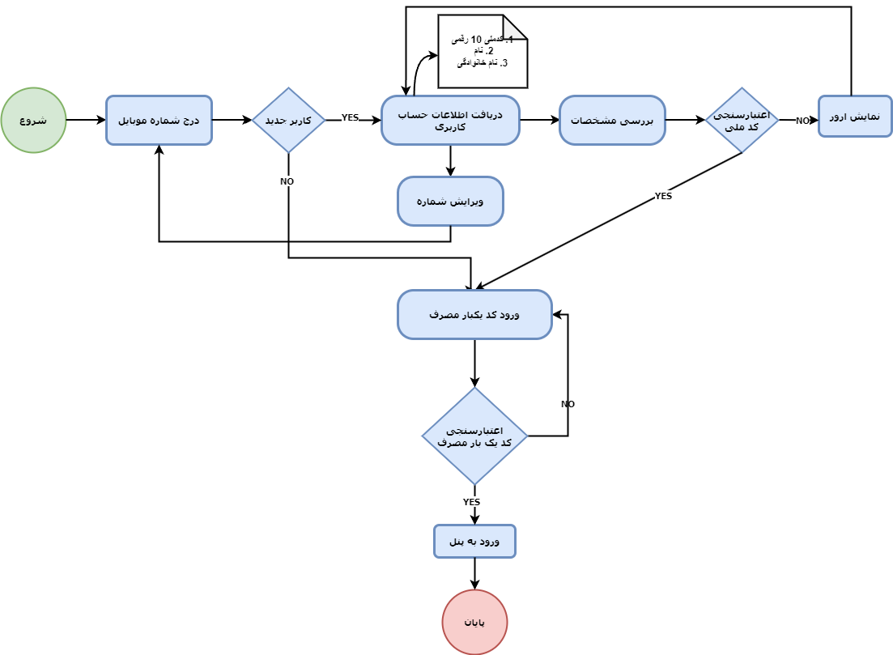

## **مقدمه**

ثبت نام در توریست پنل به دو بخش ثبت نام کاربران داخلی (هر اپلیکیشن به صورت مجزا) و ثبت نام مربوط به صاحبین مشاغل تقسیم میگردد در این مستند منظور از ثبت نام، ثبت نام از .صاحبین مشاغل نقش های زیر میباشد.

ورود از طریق [پورتال استارت](https://start.touristpanel.ir)  توریست پنل به منزله این است که شما یکی از نقش های ذکر شده در ذیل را دارا هستید و اهراز هویت کاربران صفحه استارت فقط با گذرواژه یکبار مصرف که در هر بار ورود به تلفن همراه کاربر ارسال میگردد امکان پذیر میباشد

ورود برای کاربران داخلی هر اپلیکیشن صرفا توسط دامنه اختصاصی هر اپلیکیشن که در ابتدای ایجاد به آن اپلیکشن اختصاص میپذیرد امکان پذیر بوده و  به صورت نام کاربری و گذرواژه که مدیر در زمان ایجاد کاربر به آن اختصاص داده امکان پذیر میباشد (کاربران داخلی نیاز به اهراز هویت در صفحه استارت را ندارند)

به جهت اهراز هویت بانکی (اتصال به کیف پول گردش پی) در زمان ثبت نام در صفحه استارت کد ملی مرتبط با شماره تلفن همراه ضروری میباشد 

## **اهداف**

-اهراز هویت کاربران صفحه استارت

## **عملیات**
- اهراز هویت و ثبت نام
- اهراز هویت و ورود

## **نقش ها**

- تأمین کنندگان خدمات گردشگری
- (آژانس بند ب) فروشندگان خدمات گردشگری 
- (نماینده شخص حقیقی وابسطه به یک یا چند آژانس گردشگری میباشد) نمایندگان فروش 

## **شرح جزئی عملیات ها**

در صفحه ورود میتوانید با وارد نمودن شماره تلفن همراه خود و اهراز هویت، ثبت نام و یا عملیات ورود را انجام دهید 

در صورتی که تلفن همراه شما قبلا در سیستم ثبت نشده باشد به فرم دریافت اطلاعات شخص و در غیر این صورت به فرم ورود کد اهراز هویت منتقل میشوید

در صفحه ورود کد اهراز هویت پس از وارد نمودن کدی که به شماره تلفن همراه شما ارسال شده است وارد صفحه استارت خواهید شد 

در صورت عدم ارسال کد پس از دو دقیقه با فشردن دکمه ارسال مجدد کد مجددا برای شماره همراه شما ارسال میگردد

## **فلو چارت ثبت نام و ورود به صفحه استارت**

